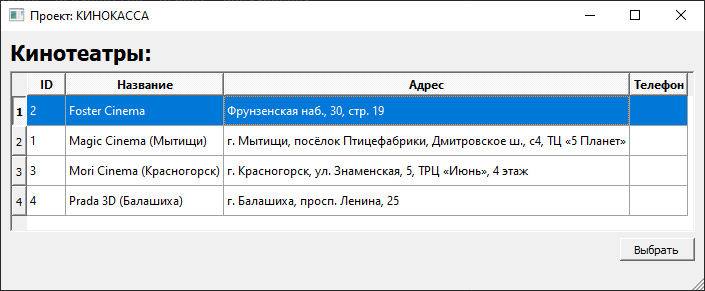
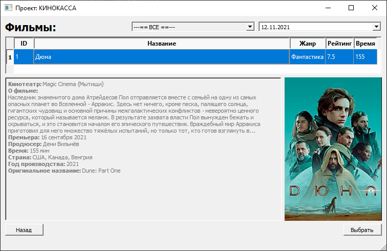
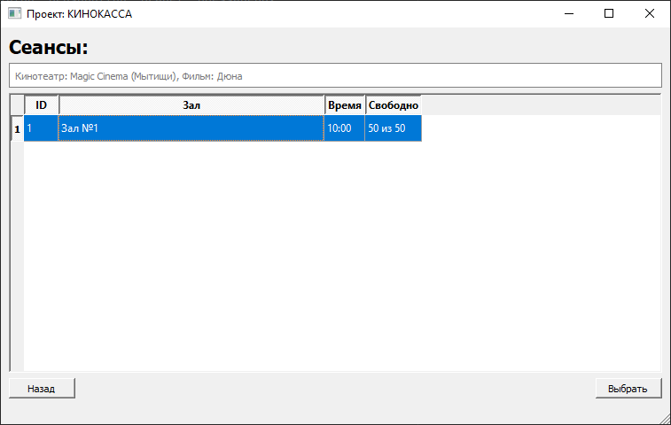
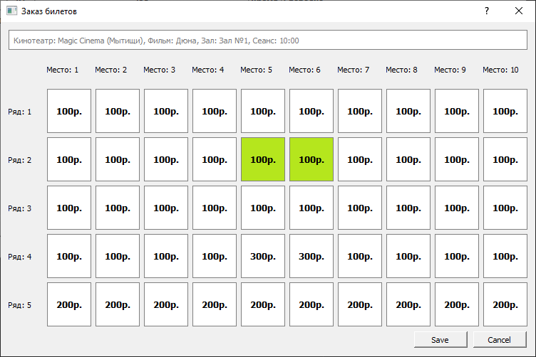
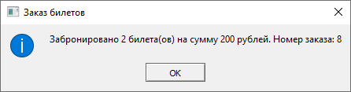
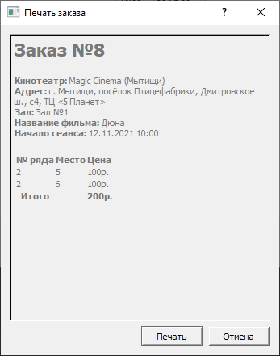

### Название проекта: 
Приложение для заказа билетов в кино на PyQT

### Автор:
Полякова Юлия Александровна

### Идея:
Удобное приложение для заказа билетов в кино, позволяющее выбрать кинотеатр, дату, фильм, время, зал и места,
а также напечатать заказ.

### Реализация:
Проект сосстоит из пяти классов. 

1. **State(Enum)** - состояние выбранного места. 
Может принимать значения: **ON** - место выбрано, **OFF** - место не выбрано.

2. **PlaceButton(QPushButton)** - класс особой кнопки для мест в зале. 
В зависимости от состояния кнопки меняет ее цвет.

    Реализованные методы:

    **get_row()** - возвращает ряд, 
    
    **get_col()** - возвращает место, 
    
    **get_state()** - возвращает состояние кнопки 
    
    **get_price()** - возвращает цену билета для этого места

3. **TicketDialog(QDialog)** - диалог выбора мест. Дизайн диалога загружается из ui файла. Из БД берется информация о выбранном 
сеансе, размере зала и выкупленных местах. На основании этих данных создаются кнопки выбора мест. Кнопки размещаются в QGridLayout.
Ранее проданные места помечаются красным цветом. На кнопках подписывается цена билета на этом месте.

    Реализованные методы:

    **get_price()** - Получение цены на билет. Цены извлекаются из словаря по следующим правилам: 
        сперва ищется конкретное место, если для него цена не определена, задется цена для всего ряда, а если нет цены для ряда, 
        тогда берется цена для всего сеанса. Правила с ценами хранятся в БД в виде JSON-строки.
    
    **place_click()** - обработчик нажатия на кнопку с местом. При нажатии переключается состояние кнопки и меняется её цвет

    **get_selected()** - возвращает список выбранных места.

4. **PrintDialog(QDialog)** - диалог отображения и печати заказа на принтере. Принимает на вход всю информацию о заказе. Формирует
заказ для печати, вызывает окно печати принтера. Дизайн диалога загружается из ui файла.

5. **MyWidget(QMainWindow)** - главное окно. Дизайн загружается из ui файла. В этом классе реализованы основные действия пользователя:
пошаговый выбор кинотеатра, фильма и сеанса. Для этого с помощью виджета QStackedWidget организовано три слоя (страницы), на которых 
размещены таблицы с данными и кнопки переходов между страницами.
Таблицы заполняются данными из БД. Если в таблице не выбрана строка с данными, то кнопка перехода к следующему шагу недоступна.
При нажатии на кнопки перехода меняется видимый слой (страница) и на страницу загружаются соответствующие данные.
На странице выбора фильма реализовано отображение подробной информации о фильме и его постера.
Имеется возможность фильтрации фильмов по жанрам и дате сеанса.

    Реализованные методы:
    
    **cmb_genre_change()** - обработчик изменения жанра фильма в комбобоксе
    
    **date_film_change()** - обработчик изменения даты сеанса
    
    **select_cinema()** - переход на страницу фильмов после выбора кинотеатра
   
    **select_film()** - переход на страницу сеансов после выбора фильма
    
    **select_session()** - запуск диалога заказа билетов после выбора сеанса и диалога печати заказа при успешном выборе мест

    **new_order()** - вычисление следующего номера заказа
    
    **save_order()** - сохранение заказа в БД
    
    **back_cinema()** - возврат на страницу выбора кинотеатра
   
    **back_film()** - возврат на страницу выбора фильма
    
    **fill_cinema()** - заполнение таблицы кинотеатров данными из БД

    **fill_film()** - заполнение таблицы фильмов данными из БД
    
    **fill_session()** - заполнение таблицы сеансов данными из БД
    
    **fill_info_film()** - выводит информацию о выбранном фильме на странице сеансов
    
    **fill_genre()** - заполнение комбобокса жанров на странице фильмов
    
    **click_cinema()** - обработчик выбора кинотеатра в таблице
    
    **click_film()** - обработчик выбора фильма в таблице
    
    **click_session()** - обработчик выбора сеанса в таблице
    
    **load_poster()** - загрузка постера для выбранного фильма
    
	**update_db()** - обновление дат сеансов в БД


### Скриншоты












### Интересные приемы:
1. Хранение в базе данных словаря в формате json строки.
	```
    self.price = json.loads(# строка из БД со словарем сцен)
	```
2. Использование html в форматированной строке:
	```
    f"<b>Кинотеатр:</b> {self.cinema_name}<br>"
	```
3. При нажатии на таблицу происходит выделение всей строки:
	```
    self.tableCinema.setSelectionMode(QAbstractItemView.SingleSelection)
    self.tableCinema.setSelectionBehavior(QAbstractItemView.SelectRows)
	```
4. Передача параметров в sql запросы двумя способами:
    - через кортежи и '?':
	```
    ...
    WHERE s.date = ?
      and c.id = ?
      and (g.id = ? or 0 = ?)
    ORDER BY f.title
    """, (self.currentDate, self.cinema, self.currentGenre, self.currentGenre))
	```
    - с помощью именнованых параметров и json:
	```
    ...
    WHERE t.session_id = :ID""", {"ID": self.session_id})
	```
5. При подсчёте кол-ва свободных мест на сеансе использовался сложный подзапрос с группировкой:
	```
	...
	LEFT JOIN (SELECT t.session_id, count(*) as cnt FROM ticket t GROUP BY t.session_id) z ON s.id = z.session_id
	```

### Библиотеки, необходимые для запуска
```python
pip install PyQt5
pip install pysqlite
pip install DateTime
pip install simplejson
pip install enum
```

### Запуск проекта
Выполнить **cinema.py**